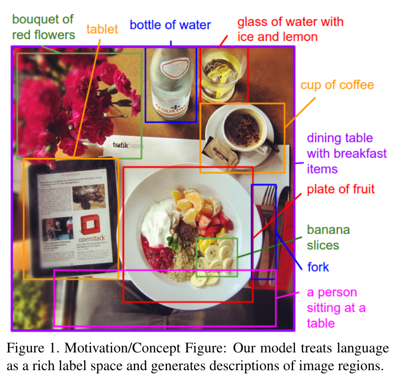
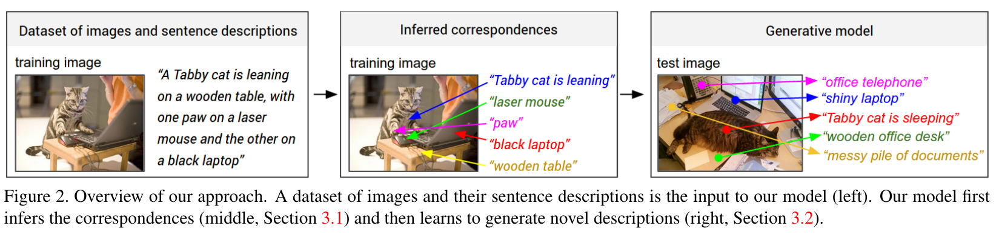
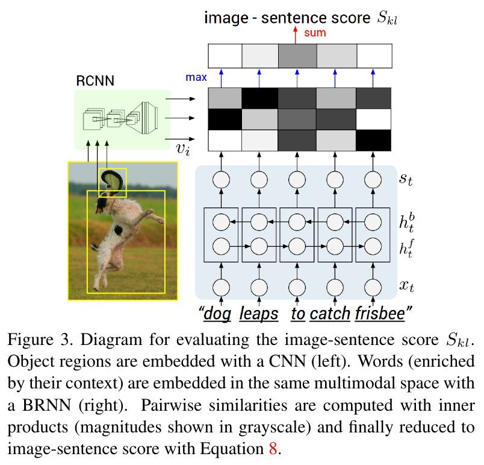

##   1.     Introduction (00 min)
###  1.1.   A brief overview on image captioning
  A quick glance at an image is sufficient for a human to
point out and describe an immense amount of details about
the visual scene [14]. However, this remarkable ability has
proven to be an elusive task for our visual recognition
models. The majority of previous work in visual recognition
has focused on labeling images with a fixed set of visual
categories and great progress has been achieved in these
endeavors [45, 11]. However, while closed vocabularies of
visual concepts constitute a convenient modeling assumption,
they are vastly restrictive when compared to the enormous
amount of rich descriptions that a human can compose.

  Some pioneering approaches that address the challenge of
generating image descriptions have been developed [29,
13]. However, these models often rely on hard-coded visual
concepts and sentence templates, which imposes limits on
their variety. Moreover, the focus of these works has been
on reducing complex visual scenes into a single sentence,
which we consider to be an unnecessary restriction.

  In this work, we strive to take a step towards the goal of
generating dense descriptions of images (Figure 1). The
primary challenge towards this goal is in the design of a
model that is rich enough to simultaneously reason about
contents of images and their representation in the domain
of natural language. Additionally, the model should be free
of assumptions about specific hard-coded templates, rules
or categories and instead rely on learning from the training
data. The second, practical challenge is that datasets of
image captions are available in large quantities on the internet
[21, 58, 37], but these descriptions multiplex mentions of
several entities whose locations in the images are unknown.

The idea is to do the following.  


In this document, the focus is put on a very old 2015 paper
[Deep Visual-Semantic Alignments for Generating Image Descriptions][karpathy2015deep] from Andrej Karpathy and Li Fei-Fei.

###  1.2.   The notebook
This notebook is a work in the Decision Making & Data Science (SDD)
class at ISAE-Supaero. The goal in to explain to other students,
professors and more generally any person having a basic background
in Machine Learning (ML), through a notebook designed to be played
in around an hour.

This notebook is organised as follows:
- a dive into the theory of the paper.
- more implementation details.
- a focus on the results and online tools to caption images.

Throughout the cells, one will find some external links to external
resources, mainly code snippets or blog posts putting results forward.  

This notebook has been timed with the help of people with basic
algorithmic and ML knowledges but not ML-experts, thus some time
anchors are being given to the reader as indication only.

###  1.3.   Some resources
One can find the list of the major resources used to write this notebook below:
- the [scholar portal][karpathy2015deep-portal] and the [paper][karpathy2015deep].
- the [standford post][karpathy2015deep-blog].
- the [code][karpathy2015deep-code].
- a [docker][karpathy2015deep-docker] wrap up.
- a [python][karpathy2015deep-python] implementation.
- a short [explanatory video][karpathy2015deep-tmpvideo].

###  1.4.   A few disclaimers
Before diving into the paper and image captioning, some disclaimers
have to be maid for the reader not to be disappointed nor surprised.

None of the codes listed above appears to work nowadays. Compilation
issues arise with the original `lua` code both on local machine and
on Google Colab servers. The docker container does not produce any
results which is not very helpful. And finally the most recent `python`
implementation is old enough to be written in `python` 2.7 for which
there is no more support and libraries do not install very well.

##   2.     The paper (00 min)
###  2.1.   Introduction (00 min)
#### Abstract
We present a model that generates natural language descriptions of
images and their regions. Our approach leverages datasets of images
and their sentence descriptions to learn about the inter-modal
correspondences between language and visual data. Our alignment model
is based on a novel combination of Convolutional Neural Networks over
image regions, bidirectional Recurrent Neural Networks
over sentences, and a structured objective that aligns the
two modalities through a multimodal embedding. We then
describe a Multimodal Recurrent Neural Network architecture that
uses the inferred alignments to learn to generate
novel descriptions of image regions. We demonstrate that
our alignment model produces state of the art results in retrieval
experiments on Flickr8K, Flickr30K and MSCOCO datasets. We then
show that the generated descriptions significantly outperform
retrieval baselines on both full images and on a new dataset of
region-level annotations.

#### Introduction
  Our core insight is that we can leverage these large
image-sentence datasets by treating the sentences as weak
labels, in which contiguous segments of words correspond to
some particular, but unknown location in the image. Our approach
is to infer these alignments and use them to learn a generative
model of descriptions. Concretely, our contributions are twofold

The contributions:
- We develop a deep neural network model that infers the latent
  alignment between segments of sentences and the region of the
  image that they describe. Our model associates the two modalities
  through a common, multimodal embedding space and a structured
  objective. We validate the effectiveness of this approach on
  image-sentence retrieval experiments in which we surpass
  the state-of-the-art.
- We introduce a multimodal Recurrent Neural Network
  architecture that takes an input image and generates
  its description in text. Our experiments show that the
  generated sentences significantly outperform retrieval-based
  baselines, and produce sensible qualitative predictions. We
  then train the model on the inferred correspondences and evaluate
  its performance on a new dataset of region-level annotations.

#### Related Work
**Dense image annotations**.  
Our work shares the high-level goal of densely annotating the contents of images with many works before us.  
[\[2\]][2] [\[48\]][48] the multimodal correspondence between words and images to annotate segments of images.  
[\[34\]][34] [\[18\]][18] [\[15\]][15] [\[33\]][33] the problem of holistic scene understanding in which the scene type, objects and their spatial support in the image is inferred.  
However, the focus of these works is on correctly labeling scenes, objects and regions with a fixed set of categories, while our focus is on richer and higher-level descriptions of regions.  

**Generating descriptions**.  
[\[21\]][21] [\[49\]][49] [\[13\]][13] [\[43\]][43] [\[23\]][23] task as a retrieval problem where the most compatible annotation in the training set is transferred to a test image  
[\[30\]][30] [\[35\]][35] [\[31\]][31] task as a retrieval problem where training annotations are broken up and stitched together   

[\[19\]][19] [\[29\]][29] [\[13\]][13] [\[55\]][55] [\[56\]][56] [\[9\]][9] [\[1\]][1] generate image captions based on fixed templates that are filled based on the content of the image  
[\[42\]][42] [\[57\]][57] generate image captions based on fixed templates that are filled based on generative grammars,  
variety of possible outputs is limited.  

[\[26\]][26] log-bilinear model that can generate full sentence descriptions for images, but their model uses a fixed window context while our Recurrent Neural Network (RNN) model conditions the probability distribution over the next word in a sentence on all previously generated words.  
[\[38\]][38] [\[54\]][54] [\[8\]][8] [\[25\]][25] [\[12\]][12] [\[5\]][5] other using RNNs to generate image descriptions.  
  
Ours simpler but suffers in performance.  

**Grounding natural language in images**.  
[\[27\]][27] [\[39\]][39] [\[60\]][60] [\[36\]][36] grounding text in the visual domain.  
[\[16\]][16] associate words and images through a semantic embedding.  
[\[24\]][24] decompose images and sentences into fragments and infer their inter-modal alignment using a ranking objective. Grounding dependency tree relations,  
our model aligns contiguous segments of sentences which are more meaningful, interpretable, and not fixed in length.  

**Neural networks in visual and language domains**.  
representing images and words in higher-level representations.  
[\[32\]][32] [\[28\]][28] Convolutional Neural Networks (CNNs) have recently emerged as a powerful class of models for image classification and object detection [\[45\]][45] .  
[\[41\]][41] [\[22\]][22] [\[3\]][3] pretrained word vectors to obtain low-dimensional representations of words.  
[\[40\]][40] [\[50\]][50] language modeling, but we additionally condition these models on images.  

###  2.2.   Learning to align visual and language data (00 min)
As stated above, we suppose in the following that we have access to huge datasets
composed of image-sentence pairs, i.e. an image and sentences describing the
elements in the image, in a natural language format.

For instance, the authors use the Flickr8K, Flickr30K and MSCOCO datasets which are
composed of exactly these pairs. I really do recommend playing with the
[online image browser][coco] of Microsoft. It is a fun and powerful way to look at
the dataset. We see that the items in the set are really only images and their caption
sentences describing the objects.

Once we have the dataset and the problem -as a reminder, we would like to
generate new captions for unseen images by using not only fixed-size descriptions
allowing richer captioning- we need to sketch the overall pipeline of the future
algorithm. This is summarized in the Figure 2 below.  


The key insight of this pipeline is that, according to the authors, "people make
frequent references to some particular, but unknown location in the image." Thus
one algorithm first need to infer from full sentences what part of the sentence
are related to what part of the image, this is the "inferred correspondences".
Once the algorithm has internalized this knowledge, we want it to put back snippets
of captioning for sub-images to form a general description of the image.

This first section focuses on the first  half of the process, i.e. going from whole
sentence descriptions to inferred correspondences.

#### 2.2.1. Representing images (00 min)
First of all, we need to represent the images in some latent space. *Reminder: a latent
space is generally a space of lower dimension containing a small amount of but
hopefully enough information about the original data. Also referred to as an
embedded space.*

The idea is to map images from their very-high dimensional native spaces of images to
20 $h$-dimensional vectors, ${v_i | i = 1, ..., 20}$. To achieve this embedding, we
use a pre-trained Region Convolutional Neural Network (RCNN) trained on the ImageNet
dataset and finetuned on the top 200 classes of the ImageNet Detection Challenge.

Then, to construct the latent vectors, the authors used the top 19 classification regions
plus an extra region for the whole image and the formula  
$$\forall i \in [|1, 20|], v_i = W_m[CNN_{\theta}(I_{b_i})] + b_m$$ (1)
Where:
  - $W_m$ is a $h \times 4096$-dimensional learned weight matrix
  - $CNN_{\theta}$ is a mapping from bounding boxes pixels in the image to $4096$-dimensional vectors.
  - $\theta$ has 60 million parameters.
```

     +-----------------+
     | B               |
   +-----------------+ |                     ,----------.   +------------------------+     +---------+    ,------.
   | G               | |                     (  I_{b_1} )-->|  CNN_{\theta}(I_{b_1}) |---->| W_m * . |--> (  v_1 )
 +-----------------+ | |                     (          )   +------------------------+     +---------+    (      )
 | R               | | |       +------+      (    .     )                .                      .         (  .   )
 |                 | | | ----> | RCNN | ---> (    .     )                .                      .         (  .   )
 |                 | | |       +------+      (    .     )                .                      .         (  .   )
 |      INPUT      | | |                     (          )   +------------------------+     +---------+    (      )
 |      IMAGE      | |-+                     ( I_{b_20} )-->| CNN_{\theta}(I_{b_20}) |---->| W_m * . |--> ( v_20 )
 |                 | |                       `----------'   +------------------------+     +---------+    `------'
 |                 |-+
 |                 |
 +-----------------+

```

#### 2.2.2. Representing sentences (00 min)
On the other hand, we need to represent the sentences as well. The choice has
been made to encode them in the same $h$-dimensional embedding space as the images.

This choice has the advantage we will be able to compare images and sentences, define
metrics between them, e.g. with the dot product as we will see later in the notebook.

To explain this part, I created the following graph showing the flow of information
across the network:
```
        +-----------------------------------------------------------------------------------------------------------------------------------------------------+
        |                                                                                                                                                     |
        |                                                                +--------------------------------+                                                   |
        |                                                           .--->| f(e_t + W_b x h_{t+1}^b + b_b) |--> h_t^b --.                                      |
        |  +-----------+          +--------------------+           /     +--------------------------------+             \    +-----------------------------+  |
1_t --->|--| W_m * 1_t |--> x_t --| f(W_e * x_t + b_e) |--> e_t --*                                     (4)              *-->| f(W_d(h_t^f + h_t^b) + b_d) |--|---> s_t
        |  +-----------+          +--------------------+           \     +--------------------------------+             /    +-----------------------------+  |
        |            (2)                             (3)            `--->| f(e_t + W_f x h_{t-1}^f + b_f) |--> h_t^f --'                                 (6)  |
        |                                                                +--------------------------------+                                                   |
        |------+                                                                                        (5)                                                   |
        | BRNN |                                                                                                                                              |
        +-----------------------------------------------------------------------------------------------------------------------------------------------------+
```
Some note about the above network flow:
- the whole network is called a Bidirectional Recurrent Neural Network (BRNN) which takes 1-hot encoding of N words over an alphabet as inputs and spits out $h$-dimensional partial score vector.
- $W_w$, $W_e$, $W_b$, $W_f$ and $W_d$ are learned weights.
- $b_e$, $b_b$, $b_f$ and $b_d$ are learned biases.
- $f$ is the ReLu activation function which is defined, from $\mathbb{R}$ to $\mathbb{R}_{+}$, as $f: x \mapsto \max(0, x)$

#### 2.2.3. Alignment objective (00 min)
Now that we are able to learn representations for both the input images and their corresponding description
sentences, we need to define a way to pair them and to give them scores. This is done as in following Figure 3,
in which one will find the two previous architectures:  
  
On the left, the image representations are generated thanks to the RCNN onto a latent space.  
On the right, the sentence representations are generated as well thanks to the BRNN onto the same latent space.  
Once all of this is computed, we are able to compute the pair-wise scores, i.e. the gray-scale matrix in the middle,
and then aggregate these scores into the top vector. This can summarized in the below equation:
- $S_{kl} = \sum_{t \in g_l}\sum_{i \in g_k}\max(0, v_i^T s_t)$ (7)
  - where $t \in g_l$ is a sentence fragment in sentence $l$.
  - and $i \in g_l$ is an image fragment in image $k$.
  - we say that the is a similarity when vectors are positively aligned. That is when the words have a confident support in the image.
- and the simpler equivalent form: $S_{kl} = \sum_{t \in g_l}\max_{i \in g_k}(v_i^T s_t)$ (8) which makes sure that "every word $s_t$ aligns to the single best image region."

Finally, the max-margin, structured loss is defined as 
$$C(\theta) = \sum_k\left[\sum_l\max(0, S_{kl} - S_+{kk} + 1) + \sum_l\max(0, S_{lk} - S_+{kk} + 1)\right]$$ (9)  
It is the general loss used as a learning criterion and can be seen as the sum of rank images plus the sum of rank sentences.

#### 2.2.4. Decoding text segment alignments to images (00 min)
generating snippets of text instead of single words.

define a Markov Random Field:
- sentence with N words.
- image with M bounding boxes.
  - $\forall j \in [1, N], a_j \in [1, M]$
  - $E(a) = \sum_{j=1}^N\psi_j^U(a_j) + \sum_{j=1}^{N-1}\psi_j^B(a_j, a_{j+1})$ (10)
  - $\psi_j^U(a_j) = v_i^T s_t$ (11)
  - $\psi_j^B(a_j, a_{j+1}) = \beta 1[a_j = a_{j+1}]$ (12)

###  2.3.   Multimodal Recurrent Neural Network for generating descriptions. (00 min)
Blah blah Multimodal Recurrent Neural Network for generating descriptions.

###  2.4.   Optimization. (00 min)
Blah blah Optimization.


##   3.     Some implementation details. (00 min)
###  3.1.   Basic torch initialization. (00 min)
###  3.2.   Create a data loader instance. (00 min)
###  3.3.   Initialize the networks (00 min)
- from file
- from scratch:
  - (1). the language model (`protos.lm`)
  - (2). the convolutional network (`protos.cnn`)
  - (3). the feature expander (`protos.expander`)
  - (4). the language model criterion (`protos.crit`)
  - use clone network to be able to write smaller checkpoints.

###  3.4.   Validation evaluation (`eval_split`) (00 min)
- (1). fetch a batch of data, pre-process it, do not augment.
- (2). forward pass :
```
         +-----+            +----------+                      +----+               +------+
images --| cnn |--> feats --| expander |--> expanded_feats -,-| lm |--> logprobs --| crit |--> loss
         +-----+            +----------+                   /  +----+               +------+
                                                 labels --'
```
- (3). sample generation samples for each image.
- (4). return `loss_sum / loss_evals, predictions={(id, caption)}. lang_stats`

###  3.5.   Loss function (`lossFun`) (00 min)
- (1). forward pass to transform images into "*back-propagatable*" losses.
```
         +--------+
images --| protos |--> loss
         +--------+
```
- (2). backward pass: criterion, `lm` and `cnn` only if finetuning.
- (3). clip gradients.
- (4). apply L2 regularization.

###  3.6.   Main loop (00 min)
- (1). eval loss and gradients.
- (2). save checkpoints: opt, iter, loss_history, val_predictions.
- (3). decay learning rates for `lm` and `cnn` $`\epsilon =2^{-frac{i - i_0}{T}}`$
- (4). parameters update.
- (5). update `cnn` if not finetuning nor warming up.
- (6). exploding loss or max iterations -> stop


##   4.     Experiments. (00 min)


##   5.     Results on the MSCOCO dataset. (00 min)


[karpathy2015deep-portal]:   https://scholar.google.com/scholar?hl=fr&as_sdt=0%2C5&q=Deep+Visual-Semantic+Alignments+for+Generating+Image+Descriptions&btnG= 
[karpathy2015deep]:          https://www.cv-foundation.org/openaccess/content_cvpr_2015/papers/Karpathy_Deep_Visual-Semantic_Alignments_2015_CVPR_paper.pdf 
[karpathy2015deep-blog]:     https://cs.stanford.edu/people/karpathy/deepimagesent/ 
[karpathy2015deep-code]:     https://github.com/karpathy/neuraltalk2
[karpathy2015deep-codedep]:  https://github.com/karpathy/neuraltalk
[karpathy2015deep-tmpvideo]: https://youtu.be/e-WB4lfg30M
[karpathy2015deep-python]:   https://github.com/ruotianluo/neuraltalk2-tensorflow
[karpathy2015deep-docker]:   https://github.com/SaMnCo/docker-neuraltalk2
[coco]:                      https://cocodataset.org/#explore

<!-- all the references from the paper -->
[1]:  https://scholar.google.com/scholar?hl=fr&as_sdt=0%2C5&q=Video+in+sentences+out.&btnG=
[2]:  https://scholar.google.com/scholar?hl=fr&as_sdt=0%2C5&q=Matching+words+and+pictures.&btnG=
[3]:  https://scholar.google.com/scholar?hl=fr&as_sdt=0%2C5&q=Neural+probabilistic+language+models.&btnG=
[4]:  https://scholar.google.com/scholar?hl=fr&as_sdt=0%2C5&q=Microsoft+coco+captions:+Data+collection+and+evaluation+server.&btnG=
[5]:  https://scholar.google.com/scholar?hl=fr&as_sdt=0%2C5&q=Learning+a+recurrent+visual+representation+for+image+caption+generation.&btnG=
[6]:  https://scholar.google.com/scholar?hl=fr&as_sdt=0%2C5&q=Imagenet:+A+large-scale+hierarchical+image+database.&btnG=
[7]:  https://scholar.google.com/scholar?hl=fr&as_sdt=0%2C5&q=Language-specific+translation+evaluation+for+any+target+language.&btnG=
[8]:  https://scholar.google.com/scholar?hl=fr&as_sdt=0%2C5&q=Long-term+recurrent+convolutional+networks+for+visual+recognition+and+description.&btnG=
[9]:  https://scholar.google.com/scholar?hl=fr&as_sdt=0%2C5&q=Image+description+using+visual+dependency+representations.&btnG=
[10]: https://scholar.google.com/scholar?hl=fr&as_sdt=0%2C5&q=Finding+structure+in+time.&btnG=
[11]: https://scholar.google.com/scholar?hl=fr&as_sdt=0%2C5&q=The+pascal+visual+object+classes+(voc)+challenge.&btnG=
[12]: https://scholar.google.com/scholar?hl=fr&as_sdt=0%2C5&q=From+captions+to+visual+concepts+and+back.&btnG=
[13]: https://scholar.google.com/scholar?hl=fr&as_sdt=0%2C5&q=Every+picture+tells+a+story:+Generating+sentences+from+images.&btnG=
[14]: https://scholar.google.com/scholar?hl=fr&as_sdt=0%2C5&q=What+do+weperceive+in+a+glance+of+a+real-world+scene?&btnG=
[15]: https://scholar.google.com/scholar?hl=fr&as_sdt=0%2C5&q=A+sentence+is+worth+athousand+pixels.&btnG=
[16]: https://scholar.google.com/scholar?hl=fr&as_sdt=0%2C5&q=Devise:+A+deep+visual-semantic+embedding+model.&btnG=
[17]: https://scholar.google.com/scholar?hl=fr&as_sdt=0%2C5&q=Rich+feature+hierarchies+for+accurate+object+detection+and+semantic+segmentation.&btnG=
[18]: https://scholar.google.com/scholar?hl=fr&as_sdt=0%2C5&q=Decomposing+a+scene+into+geometric+and+semantically+consistent+regions.&btnG=
[19]: https://scholar.google.com/scholar?hl=fr&as_sdt=0%2C5&q=From+image+annotation+to+image+description.&btnG=
[20]: https://scholar.google.com/scholar?hl=fr&as_sdt=0%2C5&q=Long+short-term+memory.Neural+computation,&btnG=
[21]: https://scholar.google.com/scholar?hl=fr&as_sdt=0%2C5&q=Framing+image+description+as+a+ranking+task:+data,+models+and+evaluation+metrics.&btnG=
[22]: https://scholar.google.com/scholar?hl=fr&as_sdt=0%2C5&q=Glove:+Global+vectors+for+word+representation.&btnG=
[23]: https://scholar.google.com/scholar?hl=fr&as_sdt=0%2C5&q=Learning+cross-modality+similarity+for+multinomial+data.&btnG=
[24]: https://scholar.google.com/scholar?hl=fr&as_sdt=0%2C5&q=Deep+fragment+embeddings+for+bidirectional+image+sentence+mapping.&btnG=
[25]: https://scholar.google.com/scholar?hl=fr&as_sdt=0%2C5&q=Unifying+visual-semantic+embeddings+with+multimodal+neural+language+models.&btnG=
[26]: https://scholar.google.com/scholar?hl=fr&as_sdt=0%2C5&q=Multimodal+neural+language+models.&btnG=
[27]: https://scholar.google.com/scholar?hl=fr&as_sdt=0%2C5&q=What+are+you+talking+about?+text-to-image+coreference.&btnG=
[28]: https://scholar.google.com/scholar?hl=fr&as_sdt=0%2C5&q=Imagenet+classification+with+deep+convolutional+neural+networks.&btnG=
[29]: https://scholar.google.com/scholar?hl=fr&as_sdt=0%2C5&q=Baby+talk:+Understanding+and+generating+simple+image+descriptions.&btnG=
[30]: https://scholar.google.com/scholar?hl=fr&as_sdt=0%2C5&q=Collective+generation+of+natural+image+descriptions.&btnG=
[31]: https://scholar.google.com/scholar?hl=fr&as_sdt=0%2C5&q=Composition+and+compression+of+trees+for+image+descriptions.&btnG=
[32]: https://scholar.google.com/scholar?hl=fr&as_sdt=0%2C5&q=Gradient-based+learning+applied+to+document+recognition.&btnG=
[33]: https://scholar.google.com/scholar?hl=fr&as_sdt=0%2C5&q=What,+where+and+who?+classifying+events+by+scene+and+object+recognition.&btnG=
[34]: https://scholar.google.com/scholar?hl=fr&as_sdt=0%2C5&q=Towards+total+scene+understanding:+Classification,+annotation+and+segmentation+in+an+automatic+framework.&btnG=
[35]: https://scholar.google.com/scholar?hl=fr&as_sdt=0%2C5&q=Composing+simple+image+descriptions+using+webscale+n-grams.&btnG=
[36]: https://scholar.google.com/scholar?hl=fr&as_sdt=0%2C5&q=Visual+semanticsearch:+Retrieving+videos+via+complex+textual+queries.&btnG=
[37]: https://scholar.google.com/scholar?hl=fr&as_sdt=0%2C5&q=Microsoft+coco:+Common+objects+in+context.&btnG=
[38]: https://scholar.google.com/scholar?hl=fr&as_sdt=0%2C5&q=Explain+images+with+multimodal+recurrent+neural+networks.&btnG=
[39]: https://scholar.google.com/scholar?hl=fr&as_sdt=0%2C5&q=Fox.+A+Joint+Model+of+Language+and+Perception+for+Grounded+Attribute+Learning.&btnG=
[40]: https://scholar.google.com/scholar?hl=fr&as_sdt=0%2C5&q=Recurrent+neural+network+based+language+model.&btnG=
[41]: https://scholar.google.com/scholar?hl=fr&as_sdt=0%2C5&q=Distributed+representations+of+words+and+phrases+and+their+compositionality.&btnG=
[42]: https://scholar.google.com/scholar?hl=fr&as_sdt=0%2C5&q=Generating+image+descriptions+from+computer+vision+detections.&btnG=
[43]: https://scholar.google.com/scholar?hl=fr&as_sdt=0%2C5&q=Im2text:+Describing+images+using+1+million+captioned+photographs.&btnG=
[44]: https://scholar.google.com/scholar?hl=fr&as_sdt=0%2C5&q=Bleu:+a+method+for+automatic+evaluation+of+machine+translation.&btnG=
[45]: https://scholar.google.com/scholar?hl=fr&as_sdt=0%2C5&q=Imagenet+large+scale+visual+recognition+challenge,&btnG=
[46]: https://scholar.google.com/scholar?hl=fr&as_sdt=0%2C5&q=Bidirectional+recurrent+neuralnetworks.&btnG=
[47]: https://scholar.google.com/scholar?hl=fr&as_sdt=0%2C5&q=Very+deep+convolutional+networks+for+large-scale+image+recognition.&btnG=
[48]: https://scholar.google.com/scholar?hl=fr&as_sdt=0%2C5&q=Connecting+modalities:+Semi-supervised+segmentation+and+annotation+of+images+using+unaligned+text+corpora.&btnG=
[49]: https://scholar.google.com/scholar?hl=fr&as_sdt=0%2C5&q=Grounded+compositional+semantics+for+finding+and+describing+images+with+sentences.&btnG=
[50]: https://scholar.google.com/scholar?hl=fr&as_sdt=0%2C5&q=Generating+text+with+recurrent+neural+networks.&btnG=
[51]: https://scholar.google.com/scholar?hl=fr&as_sdt=0%2C5&q=Going+deeper+with+convolutions.&btnG=
[52]: https://scholar.google.com/scholar?hl=fr&as_sdt=0%2C5&q=Dividethe+gradient+by+a+running+average+of+its+recent+magnitude.&btnG=
[53]: https://scholar.google.com/scholar?hl=fr&as_sdt=0%2C5&q=Cider:Consensus-based+image+description+evaluation.&btnG=
[54]: https://scholar.google.com/scholar?hl=fr&as_sdt=0%2C5&q=Show+and+tell:+A+neural+image+caption+generator.&btnG=
[55]: https://scholar.google.com/scholar?hl=fr&as_sdt=0%2C5&q=Aloimonos.Corpus-guided+sentence+generation+of+natural+images.&btnG=
[56]: https://scholar.google.com/scholar?hl=fr&as_sdt=0%2C5&q=I2t:Image+parsing+to+text+description.&btnG=
[57]: https://scholar.google.com/scholar?hl=fr&as_sdt=0%2C5&q=See+no+evil,+say+no+evil:+Description+generation+from+densely+labeled+images.&btnG=
[58]: https://scholar.google.com/scholar?hl=fr&as_sdt=0%2C5&q=From+image+descriptions+to+visual+denotations:+New+similarity+metrics+for+semantic+inference+over+event+descriptions.&btnG=
[59]: https://scholar.google.com/scholar?hl=fr&as_sdt=0%2C5&q=Recurrent+neural+network+regularization.&btnG=
[60]: https://scholar.google.com/scholar?hl=fr&as_sdt=0%2C5&q=Learning+thevisual+interpretation+of+sentences.&btnG=
